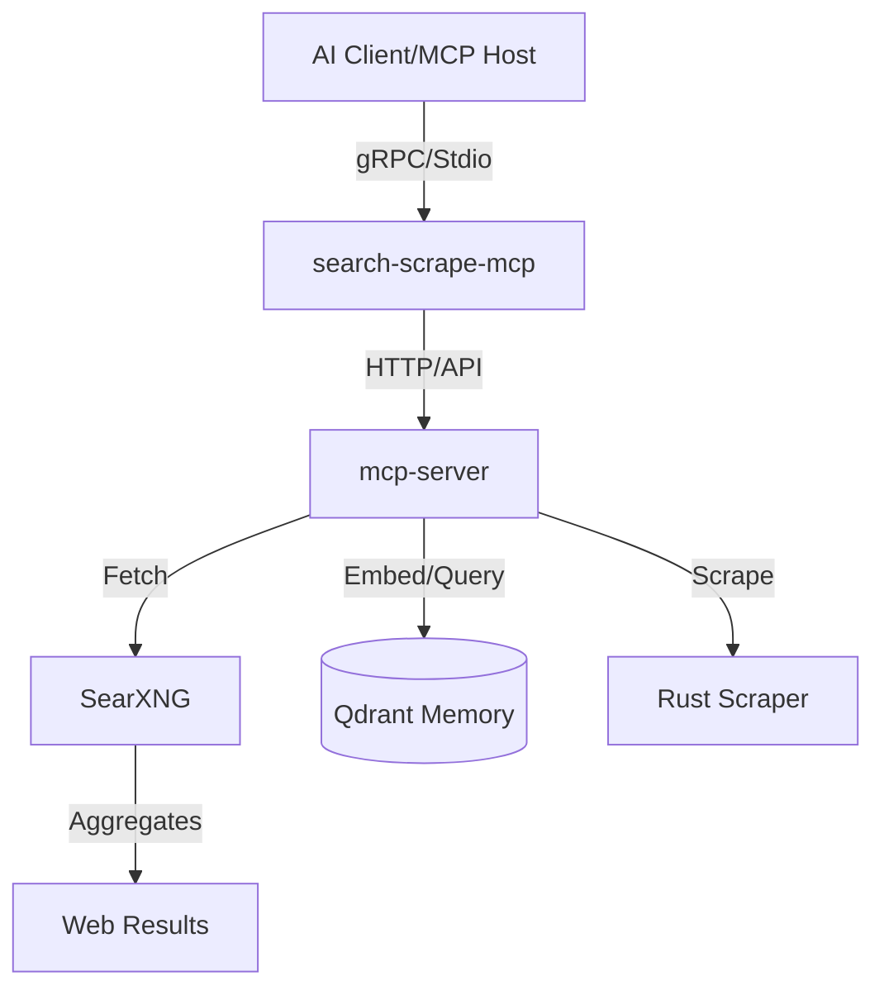

# 🔍 Search-Scrape MCP

**The ultimate 100% Free, Privacy-First, AI-Native Web Search & Scraping Engine.**  
No API keys. No subscriptions. Just the open web, structured for your AI agents.

[](https://opensource.org/licenses/MIT)
[](docs/DOCKER_DEPLOYMENT.md)
[]()

---

## 📸 Snapshot & Samples

Experience what your AI sees. Below are real-world captures of our tools in action.

| Search (`search_web`) | Scraping (`scrape_url`) |
| :---: | :---: |
|  |  |
| 📄 [View Search Sample](sample-results/search_web.txt) | 📄 [View Scrape Sample](sample-results/scrape_url.txt) |

| Structured JSON | Research History |
| :---: | :---: |
|  |  |
| 📄 [View JSON Sample](sample-results/scrape_url_json.txt) | 📄 [View History Sample](sample-results/history.txt) |

---

## 🏗️ Architecture

Our stack is designed for speed, modularity, and zero-configuration. We've moved technical depth to the `docs/` folder to keep the root clean.



### 📁 Clean Folder Structure
- `mcp-server/`: High-performance Rust backend & MCP implementation.
- [**`docs/`**](docs/): Technical guides, deployment strategies, and analysis.
- `searxng/`: Configuration for the federated search engine.
- `screenshot/`: UI/UX captures of tool outputs.
- `sample-results/`: Raw JSON/Text outputs for testing.

---

## 🛠️ Toolbelt

| Tool | Capability | Best Used For... |
| --- | --- | --- |
| `search_web` | Global search via 70+ engines | Discovering URLs, instant facts, and query suggestions. |
| `scrape_url` | Content-aware markdown extraction | Deep-reading articles with citations and metadata. |
| `crawl_website` | Recursive multi-depth crawler | Mapping out entire documentation sites or blogs. |
| `scrape_batch` | Concurrent high-speed scraping | Fetching data from dozens of URLs in seconds. |
| `extract_structured` | Schema-based data extraction | Pulling emails, prices, dates, or custom fields. |

---

## 🐳 Quick Start (The Docker Way) - **Easiest**

The simplest way to get up and running is using Docker Compose. It sets up SearXNG, Qdrant, and the MCP server automatically.

1. **Clone & Spin Up**
   ```bash
   git clone https://github.com/DevsHero/search-scrape.git
   cd search-scrape
   docker-compose up -d
   ```

2. **Verify Connectivity**
   - **SearXNG UI**: `http://localhost:8888`
   - **MCP API**: `http://localhost:5001/mcp/tools` (Should return JSON)

3. **Configure your AI Client** (Cursor/VS Code/Claude Desktop)
   Add the following as a command-line MCP:
   ```bash
   # Absolute path to the pre-built binary
   /Users/YOUR_USER/path/to/search-scrape/mcp-server/target/release/search-scrape-mcp
   ```
   *Note: Ensure `SEARXNG_URL=http://localhost:8888` is set in your environment.*

---

## 🌍 Environment Variables

Customize the behavior of your search and scrape engine.

| Name | Default | Description |
| --- | --- | --- |
| `SEARXNG_URL` | `http://localhost:8888` | Your SearXNG instance URL. |
| `QDRANT_URL` | - | Optional. Connect to Qdrant for semantic history (gRPC port 6334). |
| `FASTEMBED_CACHE_DIR` | `.fastembed_cache` | Directory for fastembed model cache (for research_history). |
| `HF_HOME` | `~/.cache/huggingface` | HuggingFace hub cache directory for model downloads. |
| `MAX_CONTENT_CHARS` | `10000` | Max characters per scrape (Prevents context blowout). |
| `MAX_BATCH_CONCURRENT` | `10` | Parallel workers for batch operations. |
| `RUST_LOG` | `info` | Logging level (`debug` for developer insights). |

---

## 📚 Documentation & Deep Dives

We keep the root folder clean by organizing documentation in the [**`docs/`**](docs/) directory:

- 📑 [**Docker Deployment Guide**](docs/DOCKER_DEPLOYMENT.md) - CI/CD and production setups.
- 📑 [**VS Code Integration**](docs/VSCODE_SETUP.md) - Setting up within your IDE.
- 📑 [**Research History Feature**](docs/HISTORY_FEATURE.md) - How we use Qdrant for memory.
- 📑 [**Setup Completion Report**](docs/DOCKER_SETUP_COMPLETE.md) - Audit of the containerization project.

---

## 🙏 Acknowledgments

Built by the community for the community. Special thanks to:
- **[@lutfi238](https://github.com/lutfi238)** for the extended crawling & batch scraping capabilities.
- **SearXNG Project** for the incredible privacy-respecting search infrastructure.

---

## ⚖️ License
MIT License. Free to use for personal and commercial projects.
