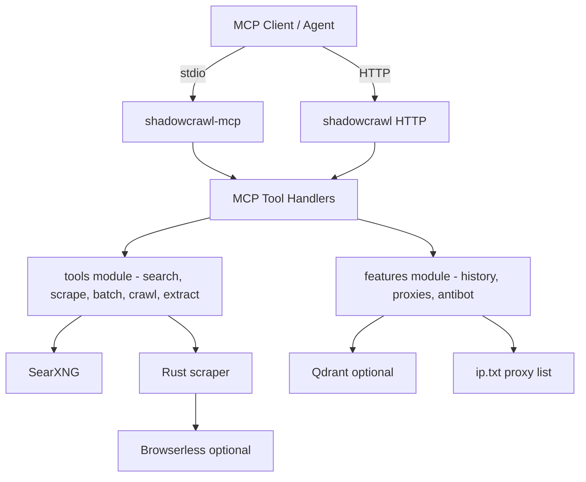

<div align="center">
    
    <h1>ShadowCrawl MCP</h1>
    <p><b>The Sovereign Stealth Intelligence Engine for AI Agents</b></p>
</div>

Self-hosted Stealth Scraping & Federated Search for AI Agents. A 100% private, free alternative to Firecrawl, Jina Reader, and Tavily. Featuring Universal Anti-bot Bypass + Semantic Research Memory, Copy-Paste setup

[](LICENSE)
[](mcp-server/Cargo.toml)
[](mcp-server/src/mcp/stdio.rs)
[](docs/RELEASE_READINESS_2026-02-12.json)
[](https://github.com/sponsors/DevsHero)

ShadowCrawl is built for AI agent workflows that need:
- Reliable multi-source web search
- Fast content extraction and website crawling
- Structured data extraction from messy pages
- Memory-aware research history with semantic recall
- Robust anti-bot & JS-heavy site support (Browserless stealth, Playwright rendering, proxy rotation)
- MCP-native usage over stdio and HTTP

If you want something you can run inside your own infra (Docker) and wire directly into Cursor/Claude via MCP, this repo is the “batteries included” baseline.

## Current release status

- Runtime version: `v1.0.0`
- Release validation: [docs/RELEASE_READINESS_2026-02-12.json](docs/RELEASE_READINESS_2026-02-12.json)
- Service health endpoint: `GET /health`
- Tool catalog endpoint: `GET /mcp/tools`
- Tool call endpoint: `POST /mcp/call`

## Tool catalog (v1.0++)

The platform currently exposes 8 MCP tools:

1. `search_web` — federated web search
2. `search_structured` — search + top result scraping
3. `scrape_url` — single URL extraction
4. `scrape_batch` — multi-URL parallel scraping
5. `crawl_website` — bounded recursive crawling
6. `extract_structured` — schema-driven extraction
7. `research_history` — semantic recall from prior runs
8. `proxy_manager` — proxy list/status/switch/test/grab operations

Tip: all tools are available via both transports:
- HTTP: `GET /mcp/tools`, `POST /mcp/call`
- MCP stdio: `shadowcrawl-mcp`

## Architecture



Code layout (after refactor):
- `mcp-server/src/core` — `AppState`, shared types
- `mcp-server/src/tools` — search/scrape/crawl/extract/batch implementations
- `mcp-server/src/features` — history (Qdrant), proxies, antibot helpers
- `mcp-server/src/nlp` — query rewriting + rerank
- `mcp-server/src/mcp` — HTTP/stdio transports + per-tool handlers + tool catalog
- `mcp-server/src/scraping` — RustScraper and its internals

## Anti-bot & JS-heavy site support

If you're evaluating paid scraping stacks, note: ShadowCrawl includes the same practical building blocks—self-hosted and customizable.

- **Browserless Chromium (optional, Docker)** — JS-heavy rendering with stealth defaults
  - Included in the default stack and configurable via `BROWSERLESS_URL` and `BROWSERLESS_TOKEN`.
  - Supports session tokens, prebooted Chrome, and ad-blocking for more stable runs.
- **Playwright rendering & marker cleanup**
  - Use the Playwright-based MCP tool for interactive rendering; includes JS marker cleanup (e.g., remove `window.__playwright`) to reduce detection signals.
- **Stealth fingerprinting**
  - Rotating user-agents, `sec-ch-ua` profiles, and stealth headers tuned for Browserless Chrome.
- **Human-like pacing & adaptive delays**
  - Jittered request delays (`SCRAPE_DELAY_PRESET`, `SCRAPE_DELAY_MIN_MS`, `SCRAPE_DELAY_MAX_MS`) and boss-domain post-load delay to mimic human patterns.
- **Proxy-driven anti-bot bypass (high-security sites)**
  - `proxy_manager` supports `grab`, `list`, `status`, `switch`, and `test` to maintain healthy proxy pools.
  - Supports multiple schemes (`http`, `https`, `socks5`) and per-request proxy selection/rotation.
  - Health checks and automatic switch logic help avoid blocked IPs.
  - For heavily protected targets, we recommend premium residential/ISP proxies combined with Browserless/Playwright rendering and stealth headers.
  - Example: use the `proxy_manager` MCP action or run a local test: `python3 scripts/proxy_manager.py test --proxy http://1.2.3.4:8080`.
- **Combinable strategies**
  - Mix Browserless rendering, Playwright interactions, stealth headers, pacing, and proxy rotation to maximize success on protected targets.

## Quick start (Docker)

1. Start stack

```bash
docker compose -f docker-compose-local.yml up -d --build
```

2. Check health

```bash
curl -s http://localhost:5001/health
```

3. Check tool surface

```bash
curl -s http://localhost:5001/mcp/tools
```

## Quick start (local Rust)

Run HTTP server:

```bash
cd mcp-server
cargo run --release
```

Run MCP stdio:

```bash
cd mcp-server
cargo run --release --bin shadowcrawl-mcp
```

## Proxy configuration (ip.txt + proxy_source.json)

This project uses **`ip.txt` as the primary proxy list**.

- `ip.txt` (one proxy per line)
   - Examples:
      - `http://1.2.3.4:8080`
      - `https://1.2.3.4:8443`
      - `socks5://1.2.3.4:1080`
- `proxy_source.json` (public sources that `proxy_manager` can fetch from)

With `docker-compose-local.yml`, the defaults are already wired:

- `IP_LIST_PATH=/home/appuser/ip.txt`
- `PROXY_SOURCE_PATH=/home/appuser/proxy_source.json`

And mounted from your repo root:

- `./ip.txt:/home/appuser/ip.txt`
- `./proxy_source.json:/home/appuser/proxy_source.json`

### Using the proxy_manager tool

The `proxy_manager` MCP tool supports actions:

- `grab` — fetch proxy lists from sources in `proxy_source.json`
- `list` — list proxies currently in `ip.txt`
- `status` — proxy manager stats (requires `IP_LIST_PATH` to exist)
- `switch` — select best proxy
- `test` — test a proxy against a target URL

## MCP client configuration (stdio)

Use this in your VS Code/Cursor `mcp.json`:

```json
{
   "servers": {
      "shadowcrawl": {
         "command": "docker",
         "args": [
            "compose",
            "-f",
            "/absolute/path/to/shadowcrawl/docker-compose-local.yml",
            "exec",
            "-i",
            "-T",
            "shadowcrawl",
            "shadowcrawl-mcp"
         ],
         "type": "stdio"
      }
   }
}
```

## Sample results

Real tool outputs (copy/paste examples):

- [sample-results/search_web.txt](sample-results/search_web.txt)
- [sample-results/search_structured_json.txt](sample-results/search_structured_json.txt)
- [sample-results/scrape_url.txt](sample-results/scrape_url.txt)
- [sample-results/scrape_url_json.txt](sample-results/scrape_url_json.txt)
- [sample-results/scrape_batch_json.txt](sample-results/scrape_batch_json.txt)
- [sample-results/crawl_website_json.txt](sample-results/crawl_website_json.txt)
- [sample-results/extract_structured_json.txt](sample-results/extract_structured_json.txt)
- [sample-results/research_history_json.txt](sample-results/research_history_json.txt)
- [sample-results/proxy_manager_json.txt](sample-results/proxy_manager_json.txt)

## What changed from v0.3.x to v1.0++

- Introduced production MCP surface with unified HTTP + stdio tool behavior
- Added and validated `proxy_manager` operational workflow
- Expanded tooling to full 8-tool set with end-to-end readiness checks
- Improved server lifecycle handling for stdio MCP reliability
- Centralized tool schema/catalog definitions to reduce drift
- Added release validation artifacts and readiness reporting

Detailed notes: [docs/RELEASE_NOTES_v1.0.0.md](docs/RELEASE_NOTES_v1.0.0.md)

## Key environment variables

| Variable | Purpose | Default |
| --- | --- | --- |
| `SEARXNG_URL` | search backend URL | `http://searxng:8080` |
| `QDRANT_URL` | semantic memory backend | unset |
| `BROWSERLESS_URL` | browser rendering backend | unset |
| `HTTP_TIMEOUT_SECS` | outbound timeout | `30` |
| `HTTP_CONNECT_TIMEOUT_SECS` | connect timeout | `10` |
| `OUTBOUND_LIMIT` | concurrency limiter | `32` |
| `IP_LIST_PATH` | proxy ip list path | `ip.txt` |
| `PROXY_SOURCE_PATH` | proxy source list path | `proxy_source.json` |

Proxy config templates:
- `docs/examples/proxy_source.example.json`
NOTE: `ip.txt` is tracked in the repo root and is the canonical proxy list.

## Comparison (quick decision guide)

This project is meant to be self-hosted infrastructure. A rough mental model:

| If you use… | You may prefer ShadowCrawl when… |
| --- | --- |
| Firecrawl / other hosted scraping APIs | You want local control (cost, privacy, networking), MCP-native integration, and can run Docker. |
| Jina Reader / “reader mode” services | You need more than reader conversion: crawling, batch mode, structured extraction, and a single MCP tool surface. |
| Browserless (alone) | You want Browserless as an optional backend, but with a full tool suite (search/crawl/extract/proxy/history) around it. |
| Bright Data / proxy networks | You already have proxy sources, and want a Rust/MCP orchestration layer + rotation/health logic on top (this repo does not ship a proxy network). |

## Production checklist

- [x] Build passes (`cargo check`)
- [x] Release build passes (`cargo build --release`)
- [x] MCP tool surface is discoverable (`/mcp/tools`)
- [x] Core tools return expected payloads
- [x] Proxy manager commands operational
- [x] Health endpoint stable
- [x] Release validation artifact generated

Operational checklist document: [docs/GA_REFACTOR_READINESS_2026-02-12.md](docs/GA_REFACTOR_READINESS_2026-02-12.md)

## Repository map

- [mcp-server/src](mcp-server/src) — Rust core server and MCP handlers
- [docs](docs) — release reports, architecture notes, operational guidance
- [docs/IDE_SETUP.md](docs/IDE_SETUP.md) — MCP client setup for popular IDEs/apps
- [docs/SEARXNG_TUNING.md](docs/SEARXNG_TUNING.md) — tuning SearXNG for noise / bans
- [searxng](searxng) — SearXNG runtime configuration
- [sample-results](sample-results) — sample outputs

## 🙏 Acknowledgments & Support

Built with ❤️ by a **Solo Developer** for the open-source community.

I'm actively maintaining this project to provide the best free search & scraping infrastructure for AI agents.
- **Found a bug?** I'm happy to fix it! Please [Open an Issue](https://github.com/DevsHero/shadowcrawl/issues).
- **Want a new feature?** Feature requests are welcome! Let me know what you need.
- **Love the project?** Start the repo ⭐ or buy me a coffee to support development!

[](https://github.com/sponsors/DevsHero)

Special thanks to:
- **SearXNG Project** for the incredible privacy-respecting search infrastructure.
- **Qdrant** for the vector search engine.
- **Rust Community** for the amazing tooling.

---
## License

MIT License. Free to use for personal and commercial projects.
