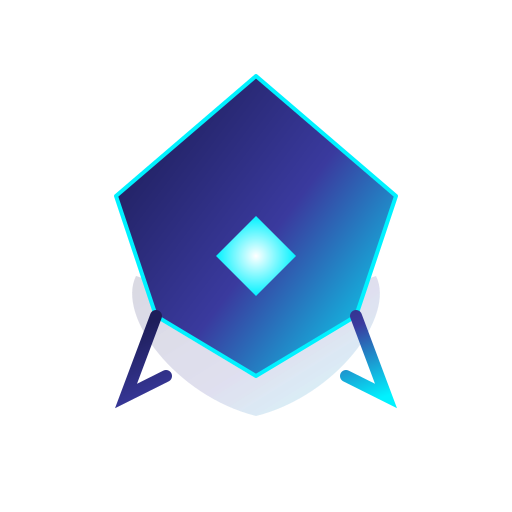

# 🥷 ShadowCrawl MCP — v2.4.3

<div align="center">

<h3><b>Search Smarter. Scrape Anything. Block Nothing.</b></h3>
<p><b>The God-Tier Intelligence Engine for AI Agents</b></p>
<p><i>The Sovereign, Self-Hosted Alternative to Firecrawl, Jina, and Tavily.</i></p>

[](https://opensource.org/licenses/MIT)
[](https://www.rust-lang.org/)
[](https://modelcontextprotocol.io/)
[](https://github.com/DevsHero/ShadowCrawl/actions/workflows/ci.yml)
</div>

---

**ShadowCrawl** is not just a scraper or a search wrapper — it is a **complete intelligence layer** purpose-built for AI Agents. ShadowCrawl ships a **native Rust meta-search engine** running inside the same binary. Zero extra containers. Parallel engines. LLM-grade clean output.

When every other tool gets blocked, ShadowCrawl doesn't retreat — it **escalates**: native engines → native Chromium CDP headless → Human-In-The-Loop (HITL) nuclear option. You always get results.

---

## ⚡ God-Tier Internal Meta-Search (v2.4.3)

ShadowCrawl v2.4.3 ships a **100% Rust-native metasearch engine** that queries 4 engines in parallel and fuses results intelligently:

| Engine | Coverage | Notes |
|--------|----------|-------|
| 🔵 **DuckDuckGo** | General Web | HTML scrape, no API key needed |
| 🟢 **Bing** | General + News | Best for current events |
| 🔴 **Google** | Authoritative Results | High-relevance, deduped |
| 🟠 **Brave Search** | Privacy-Focused | Independent index, low overlap |

### 🧠 What makes it God-Tier?

**Parallel Concurrency** — All 4 engines fire simultaneously. Total latency = slowest engine, not sum of all.

**Smart Deduplication + Scoring** — Cross-engine results are merged by URL fingerprint. Pages confirmed by 2+ engines receive a corroboration score boost. Domain authority weighting (docs, .gov, .edu, major outlets) pushes high-trust sources to the top.

**Ultra-Clean Output for LLMs** — Clean fields and predictable structure:
- `published_at` is parsed and stored as a clean **ISO-8601 field** (`2025-07-23T00:00:00`)
- `content` / `snippet` is clean — zero date-prefix garbage
- `breadcrumbs` extracted from URL path for navigation context
- `domain` and `source_type` auto-classified (`blog`, `docs`, `reddit`, `news`, etc.)

**Result: LLMs receive dense, token-efficient, structured data — not a wall of noisy text.**

**Unstoppable Fallback** — If an engine returns a bot-challenge page (`anomaly.js`, Cloudflare, PerimeterX), it is automatically retried via the native Chromium CDP instance (headless Chrome, bundled in-binary). No manual intervention. No 0-result failures.

**Quality > Quantity** — ~20 deduplicated, scored results rather than 50 raw duplicates. For an AI agent with a limited context window, 20 high-quality results outperform 50 noisy ones every time.

---

## 🛠 Full Feature Roster

| Feature | Details |
|---------|---------|
| 🔍 **God-Tier Meta-Search** | Parallel Google / Bing / DDG / Brave · dedup · scoring · breadcrumbs · `published_at` |
| 🕷 **Universal Scraper** | Rust-native + native Chromium CDP for JS-heavy and anti-bot sites |
| 🧠 **Semantic Memory** | Embedded LanceDB + Model2Vec for long-term research recall (no DB container) |
| 🤖 **HITL Non-Robot Search** | Visible Brave Browser + keyboard hooks for human CAPTCHA / login-wall bypass |
| 🌐 **Deep Crawler** | Recursive, bounded crawl to map entire subdomains |
| 🔒 **Proxy Master** | Native HTTP/SOCKS5 pool rotation with health checks |
| 🧽 **Universal Janitor** | Strips cookie banners, popups, skeleton screens — delivers clean Markdown |
| 🔥 **Hydration Extractor** | Resolves React/Next.js hydration JSON (`__NEXT_DATA__`, embedded state) |
| 🛡 **Anti-Bot Arsenal** | Stealth UA rotation, fingerprint spoofing, CDP automation, mobile profile emulation |
| 📊 **Structured Extract** | CSS-selector + prompt-driven field extraction from any page |
| 🔁 **Batch Scrape** | Parallel scrape of N URLs with configurable concurrency |

---

## 🏗 Zero-Bloat Architecture

ShadowCrawl is **pure binary**: a single Rust executable exposes MCP tools (stdio) and an optional HTTP server — no Docker, no sidecars.

---

## 💎 The Nuclear Option: Non-Robot Search (HITL)

Automation hits a wall? ShadowCrawl **uses a real human** when it matters.

`non_robot_search` launches a **visible, native Brave Browser** on your machine. If the site demands a CAPTCHA, login, or puzzle — you solve it once; the agent continues uninterrupted.

- 🦁 **Brave Integration** — Real browser profiles (cookies, sessions) indistinguishable from legitimate traffic
- 🛡 **Safety Kill Switch** — Hold `ESC` for 3 seconds to abort any runaway automation
- 🔄 **Session Continuity** — `SHADOWCRAWL_RENDER_PROFILE_DIR` persists cookies between runs
- 📈 **Automatic Escalation** — Normal scrape → native Chromium CDP → HITL. You control the ceiling.

> ⚠️ HITL requires the binary running **natively** (desktop session). The visible browser needs access to your host display, keyboard hooks, and OS permissions.

---

## 💥 Boss-Level Anti-Bot Evidence

We don't claim — we show receipts. All captured with `non_robot_search` + Safety Kill Switch (2026-02-14):

| Target | Protection | Evidence | Extracted |
|--------|-----------|----------|-----------|
| **LinkedIn** | Cloudflare + Auth | [JSON](proof/linkedin_evidence.json) · [Snippet](proof/linkedin_raw_snippet.txt) | 60+ job listings ✅ |
| **Ticketmaster** | Cloudflare Turnstile | [JSON](proof/ticketmaster_evidence.json) · [Snippet](proof/ticketmaster_raw_snippet.txt) | Tour dates & venues ✅ |
| **Airbnb** | DataDome | [JSON](proof/airbnb_evidence.json) · [Snippet](proof/airbnb_raw_snippet.txt) | 1,000+ Tokyo listings ✅ |
| **Upwork** | reCAPTCHA | [JSON](proof/upwork_evidence.json) · [Snippet](proof/upwork_raw_snippet.txt) | 160K+ job postings ✅ |
| **Amazon** | AWS Shield | [JSON](proof/amazon_evidence.json) · [Snippet](proof/amazon_raw_snippet.txt) | RTX 5070 Ti search results ✅ |
| **nowsecure.nl** | Cloudflare | [JSON](proof/nowsecure_evidence.json) | Manual button verified ✅ |

📖 Full analysis: [proof/README.md](proof/README.md)

---

## 📦 Quick Start

### Option A — Download Prebuilt Binaries (Recommended)

Download the latest release assets from GitHub Releases and run one of:

Prebuilt assets are published for: `windows-x64`, `windows-arm64`, `linux-x64`, `linux-arm64`.

- `shadowcrawl-mcp` — MCP stdio server (recommended for VS Code / Cursor / Claude Desktop)
- `shadowcrawl` — HTTP server (default port `5000`; override via `--port`, `PORT`, or `SHADOWCRAWL_PORT`)

Confirm the HTTP server is alive:
```bash
./shadowcrawl --port 5000
curl http://localhost:5000/health
```

---

## 🧪 Build (Release, All Features)

Build all binaries with all optional features enabled:

```bash
cd mcp-server
cargo build --release --all-features
```

---
### Option B — Build / Install from Source

```bash
git clone https://github.com/DevsHero/shadowcrawl.git
cd shadowcrawl
```

Build:
```bash
cd mcp-server
cargo build --release --features non_robot_search --bin shadowcrawl --bin shadowcrawl-mcp
```

Or install (puts binaries into your Cargo bin directory):
```bash
cargo install --path mcp-server --locked
```

Binaries land at:
- `target/release/shadowcrawl` — HTTP server (default port `5000`; override via `--port`, `PORT`, or `SHADOWCRAWL_PORT`)
- `target/release/shadowcrawl-mcp` — MCP stdio server

Prerequisites for HITL:
- **Brave Browser** ([brave.com/download](https://brave.com/download/))
- **Accessibility permission** (macOS: System Preferences → Privacy & Security → Accessibility)
- A desktop session (not SSH-only)

Platform guides: [WINDOWS_DESKTOP.md](docs/WINDOWS_DESKTOP.md) · [UBUNTU_DESKTOP.md](docs/UBUNTU_DESKTOP.md)

> After any binary rebuild/update, **restart your MCP client session** to pick up new tool definitions.

---
## 🧾 Raw Samples (NeuroSiphon vs non-NeuroSiphon vs fetch)

Generate raw sample files to study output completeness/quality and tokenizer savings.

- NeuroSiphon **enabled** (default)
- NeuroSiphon **disabled**: `SHADOWCRAWL_NEUROSIPHON=0`
- `fetch` baseline: direct HTTP GET saved as raw HTML

This also generates metasearch samples (JSON) via the `/search` endpoint.

```bash
python3 ./scripts/generate_samples.py --release
```

If you want the script to build the release binaries first:

```bash
python3 ./scripts/generate_samples.py --build --release
```

Outputs are saved under `samples/`.

Tip (short output): when you only need the parts of a long doc that match your question, use `web_fetch` with:

- `query`: your question
- `extract_relevant_sections=true`: returns only the top matching sections (short, avoids huge tool outputs)


---

## 🧬 NeuroSiphon Token-Saving Pipeline (v2.4.0)

ShadowCrawl v2.4.0 integrates **token-efficiency techniques** inspired by NeuroSiphon:

- Repo: https://github.com/DevsHero/NeuroSiphon
- Kill switch: set `SHADOWCRAWL_NEUROSIPHON=0` to disable all NeuroSiphon behaviors.

These techniques focus on **returning only the most useful content to the agent**, avoiding token leaks (raw HTML, boilerplate imports, DOM scaffolding on SPAs).

| Technique | Trigger | Output behavior | Benefit (tokenizer) |
|----------|---------|-----------------|---------------------|
| **Semantic Shaving** (Rule A + Hotfix A) | `web_fetch` (alias: `scrape_url`) with `query` + `strict_relevance=true` | Keeps only semantically relevant paragraphs | Cuts 50–80% noisy text on long pages |
| **Import Nuker** (Rule B + Hotfix B) | NeuroSiphon enabled + aggressive mode + non-tutorial URL | Removes large `import/require/use` blocks (guarded by heuristics + 15-line minimum) | Removes high-noise “dependency walls” in code blocks |
| **SPA State Fast-Path** (Rule C) | SPA detected and embedded state exists | Prefers hydration JSON when it’s large enough (≥100 words) | Avoids DOM boilerplate on JS-heavy sites |
| **Strict App State Mode** (Task 3) | `extract_app_state=true` and SPA state found | Returns hydration JSON as the **only** content; clears `code_blocks`, `links`, `images`, `headings` | Prevents DOM scaffolding from wasting tokens |
| **Raw HTML Leak Stopper** (Task 1) | NeuroSiphon enabled OR aggressive mode | Forces `include_raw_html=false` even if caller requests it | Prevents massive `<!DOCTYPE html>` token leaks |
| **Tutorial Immunity** (Task 2) | docs/tutorial/guide URLs | Disables import nuking entirely | Preserves critical tutorial context |
| **Search Snippet Floor** (Rule D) | internal metasearch | Ensures snippets are useful (min-length) | Avoids useless micro-snippets that waste context |


## 🧩 MCP Integration

ShadowCrawl exposes all tools via the **Model Context Protocol** (stdio transport).

### VS Code / Copilot Chat 

Add to your MCP config (`~/.config/Code/User/mcp.json`):

```jsonc
{
  "servers": {
    "shadowcrawl": {
      "type": "stdio",
      "command": "env",
      "args": [
        "RUST_LOG=info",
        "SEARCH_ENGINES=google,bing,duckduckgo,brave",
        "LANCEDB_URI=/YOUR_PATH/shadowcrawl/lancedb",
        "HTTP_TIMEOUT_SECS=30",
        "MAX_CONTENT_CHARS=10000",
        "IP_LIST_PATH=/YOUR_PATH/shadowcrawl/ip.txt",
        "PROXY_SOURCE_PATH=/YOUR_PATH/shadowcrawl/proxy_source.json",
        "/YOUR_PATH/shadowcrawl/mcp-server/target/release/shadowcrawl-mcp"
      ]
    }
  }
}
```

### Cursor / Claude Desktop

Use the same stdio setup as VS Code (run `shadowcrawl-mcp` locally and pass env vars via `env` or your client’s `env` field).

📖 Full multi-IDE guide: [docs/IDE_SETUP.md](docs/IDE_SETUP.md)

---

## ⚙️ Key Environment Variables

| Variable | Default | Description |
|----------|---------|-------------|
| `CHROME_EXECUTABLE` | auto-detected | Override path to Chromium/Chrome/Brave binary |
| `SEARCH_ENGINES` | `google,bing,duckduckgo,brave` | Active search engines (comma-separated) |
| `SEARCH_MAX_RESULTS_PER_ENGINE` | `10` | Results per engine before merge |
| `SEARCH_CDP_FALLBACK` | `true` if browser found | Auto-retry blocked engines via native Chromium CDP (alias: `SEARCH_BROWSERLESS_FALLBACK`) |
| `SEARCH_SIMULATE_BLOCK` | — | Force blocked path for testing: `duckduckgo,bing` or `all` |
| `LANCEDB_URI` | — | Path for semantic research memory (optional) |
| `SHADOWCRAWL_NEUROSIPHON` | `1` (enabled) | Set to `0` / `false` / `off` to disable all NeuroSiphon techniques (import nuking, SPA extraction, semantic shaving, search reranking) |
| `HTTP_TIMEOUT_SECS` | `30` | Per-request timeout |
| `OUTBOUND_LIMIT` | `32` | Max concurrent outbound connections |
| `MAX_CONTENT_CHARS` | `10000` | Max chars per scraped document |
| `IP_LIST_PATH` | — | Path to proxy IP list |
| `SCRAPE_DELAY_PRESET` | `polite` | `fast` / `polite` / `cautious` |

---

## 🏆 Comparison

| Feature | Firecrawl / Jina / Tavily | ShadowCrawl v2.4.0 |
|---------|--------------------------|-------------------|
| **Cost** | $49–$499/mo | **$0 — self-hosted** |
| **Privacy** | They see your queries | **100% private, local-only** |
| **Search Engine** | Proprietary / 3rd-party API | **Native Rust (4 engines, parallel)** |
| **Result Quality** | Mixed, noisy snippets | **Deduped, scored, LLM-clean** |
| **Cloudflare Bypass** | Rarely | **Native Chromium CDP + HITL fallback** |
| **LinkedIn / Airbnb** | Blocked | **99.99% success (HITL)** |
| **JS Rendering** | Cloud API | **Native Brave + bundled Chromium CDP** |
| **Semantic Memory** | None | **Embedded LanceDB + Model2Vec** |
| **Proxy Support** | Paid add-on | **Native SOCKS5/HTTP rotation** |
| **MCP Native** | Partial | **Full MCP stdio + HTTP** |


### ☕ Acknowledgments & Support

ShadowCrawl is built with ❤️ by a **solo developer** for the open-source AI community.
If this tool saved you from a $500/mo scraping API bill:

- ⭐ **Star the repo** — it helps others discover this
- 🐛 **Found a bug?** [Open an issue](https://github.com/DevsHero/shadowcrawl/issues)
- 💡 **Feature request?** Start a discussion
- ☕ **Fuel more updates:**

[](https://github.com/sponsors/DevsHero)

**License:** MIT — free for personal and commercial use.

