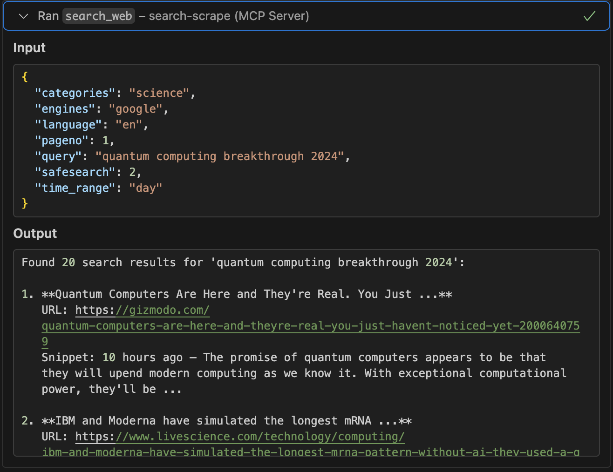

# Search-Scrape

**100% Free** web search and scraping MCP tools for AI assistants. No API keys, no costs, no limits.

## ✨ Features

- 🔍 **Advanced Search**: Full SearXNG parameter support (engines, categories, language, safesearch, time_range, pagination)
- 🕷️ **Intelligent Scraping**: Smart content extraction with automatic noise filtering (ads, nav, footers removed)
- 🔗 **Smart Link Filtering**: Extracts links from main content area only, avoiding navigation clutter
- 📝 **Source Citations**: Automatic reference-style `[1]`, `[2]` citations with clickable URLs in Sources section
- 🎯 **Configurable Limits**: Control max links, images, and content focus via parameters or env vars
- 🔧 **Native MCP Tools**: Direct integration with VS Code, Cursor, and other AI assistants
- 💰 **100% Free**: No API keys or subscriptions required - runs completely locally
- 🛡️ **Privacy First**: All processing happens on your machine
- ⚡ **Performance**: Built-in caching (10min search, 30min scrape), retry logic, and concurrency control
- 🎨 **Content-Aware**: Special handling for documentation sites (mdBook, GitBook, etc.)

### 📸 Screenshot

Here are screenshots showing the MCP tools working in Vscode, Cursor, Trae:

#### Search Web Tool


#### Scrape URL Tool  


## 🚀 Quick Start

```bash
# 1. Start SearXNG search engine
docker-compose up searxng -d

# 2. Build MCP server
cd mcp-server && cargo build --release

# 3. Add to your AI assistant's MCP config:
{
  "mcpServers": {
    "search-scrape": {
      "command": "/path/to/mcp-server/target/release/search-scrape-mcp",
      "env": { 
        "SEARXNG_URL": "http://localhost:8888",
        "SEARXNG_ENGINES": "google,bing,duckduckgo",
        "MAX_LINKS": "100"
      }
    }
  }
}
```

### Environment Variables

| Variable | Default | Description |
|----------|---------|-------------|
| `SEARXNG_URL` | `http://localhost:8888` | SearXNG instance URL |
| `SEARXNG_ENGINES` | `duckduckgo,google,bing` | Default search engines (comma-separated) |
| `MAX_LINKS` | `100` | Max links to return in Sources section |
| `RUST_LOG` | - | Log level: `error`, `warn`, `info`, `debug`, `trace` |

## � MCP Tools

### `search_web` - Advanced Web Search
**Enhanced with full SearXNG parameter support:**
- **engines**: `google`, `bing`, `duckduckgo`, etc.
- **categories**: `general`, `news`, `it`, `science`, etc.
- **language**: `en`, `es`, `fr`, `de`, etc.
- **safesearch**: `0` (off), `1` (moderate), `2` (strict)
- **time_range**: `day`, `week`, `month`, `year`
- **pageno**: Page number for pagination

```json
{
  "query": "rust programming",
  "engines": "google,bing",
  "categories": "it,general",
  "language": "en",
  "safesearch": 1,
  "time_range": "month"
}
```

### `scrape_url` - Optimized Content Extraction
**Intelligent scraping with advanced cleanup:**
- ✅ **Smart Link Filtering**: Extracts links from main content (article/main tags) only
- ✅ **Source Citations**: Returns `[1]`, `[2]` markers with full URL mapping in Sources section
- ✅ **Noise Removal**: Automatically removes ads, navigation, footers, and boilerplate
- ✅ **Clean Text**: Extracts article text with proper formatting preserved
- ✅ **Rich Metadata**: OpenGraph, author, publish date, reading time, canonical URL
- ✅ **Structured Data**: Headings (H1-H6), images with alt text, language detection
- ✅ **Documentation Sites**: Special handling for mdBook, GitBook, and similar formats
- ✅ **Fallback Methods**: Multiple extraction strategies for difficult sites
- ✅ **Configurable**: Control link/image limits and filtering behavior

**Parameters:**
```json
{
  "url": "https://doc.rust-lang.org/book/ch01-00-getting-started.html",
  "content_links_only": true,  // Optional: smart filter (default: true)
  "max_links": 100             // Optional: limit sources (default: 100, max: 500)
}
```

**Example Output:**
```markdown
**Getting Started - The Rust Programming Language**

URL: https://doc.rust-lang.org/book/ch01-00-getting-started.html
Word Count: 842
Language: en

**Content:**
This chapter covers how to install Rust, write a Hello World program...
Learn more about [Cargo][1] and the [installation process][2].

**Sources:**
[1]: https://doc.rust-lang.org/cargo/ (Cargo documentation)
[2]: https://doc.rust-lang.org/book/ch01-01-installation.html (Installation)
[3]: https://doc.rust-lang.org/book/ch01-02-hello-world.html (Hello World)
...
```

## 🛠️ Development

### HTTP API Testing
```bash
# Test search with parameters
curl -X POST "http://localhost:5000/search" \
  -H "Content-Type: application/json" \
  -d '{"query": "AI", "engines": "google", "language": "en"}'

# Test optimized scraping with smart filtering
curl -X POST "http://localhost:5000/scrape" \
  -H "Content-Type: application/json" \
  -d '{"url": "https://example.com", "content_links_only": true, "max_links": 50}'
```

### Running the Server
```bash
# HTTP server (port 5000)
cd mcp-server
SEARXNG_URL=http://localhost:8888 cargo run --release --bin mcp-server

# MCP stdio server (for AI assistants)
SEARXNG_URL=http://localhost:8888 ./target/release/search-scrape-mcp

# With debug logging
RUST_LOG=debug SEARXNG_URL=http://localhost:8888 cargo run --release
```

### Performance Tuning

**Cache Settings** (in `src/main.rs` and `src/stdio_service.rs`):
```rust
search_cache: 10_000 entries, 10 min TTL
scrape_cache: 10_000 entries, 30 min TTL
outbound_limit: 32 concurrent requests
```

**Optimization Tips:**
- Use `content_links_only: true` to reduce noise (enabled by default)
- Set `max_links` lower (e.g., 20-50) for faster responses
- Use `SEARXNG_ENGINES` env var to limit search engines
- Enable `RUST_LOG=info` for production monitoring

## 📁 Project Structure

```
├── mcp-server/           # Native Rust MCP server
│   ├── src/
│   │   ├── main.rs       # HTTP server entry point
│   │   ├── stdio_service.rs  # MCP stdio server (for AI assistants)
│   │   ├── search.rs     # SearXNG integration with full parameter support  
│   │   ├── scrape.rs     # Scraping orchestration with caching & retry
│   │   ├── rust_scraper.rs   # Advanced extraction, noise filtering, smart links
│   │   ├── mcp.rs        # MCP HTTP endpoints
│   │   ├── types.rs      # Data structures & API types
│   │   └── lib.rs        # Shared application state
│   └── target/release/   # Compiled binaries (mcp-server, search-scrape-mcp)
├── searxng/             # SearXNG configuration
│   ├── settings.yml     # Search engine settings
│   └── uwsgi.ini        # UWSGI server config
└── docker-compose.yml   # Container orchestration
```

## 💡 Best Practices

### For AI Assistants
- **Use smart filtering**: Keep `content_links_only: true` (default) to avoid nav/footer links
- **Limit sources**: Set `max_links: 20-50` for cleaner responses when you don't need all links
- **Follow citations**: Use the `[1]`, `[2]` markers in content to find specific sources
- **Search first, scrape second**: Use `search_web` to find URLs, then `scrape_url` for deep content

### For Developers
- **Cache effectively**: Search results cached 10min, scrapes cached 30min
- **Handle errors gracefully**: Retry logic built-in (exponential backoff)
- **Monitor performance**: Use `RUST_LOG=info` to track cache hits and timing
- **Customize engines**: Set `SEARXNG_ENGINES` for domain-specific search
- **Rate limiting**: Built-in semaphore (32 concurrent) prevents overwhelming targets

### For Content Extraction
- **Documentation sites work great**: mdBook, GitBook auto-detected
- **JavaScript-heavy sites**: May have limited content (no JS execution)
- **Prefer canonical URLs**: Tool extracts canonical link when available
- **Reading time**: Automatically calculated at ~200 words/minute

## 🔧 Troubleshooting

**SearXNG not responding:**
```bash
docker-compose restart searxng
# Check logs: docker-compose logs searxng
```

**Empty scrape results:**
- Site may be JavaScript-heavy (we don't execute JS)
- Try the URL in a browser to verify content is in HTML
- Check logs with `RUST_LOG=debug` for detailed extraction info

**Too many/too few links:**
- Adjust `max_links` parameter (default: 100, max: 500)
- Use `content_links_only: false` to get all document links
- Use `content_links_only: true` for main content only (default)

**Slow responses:**
- Check cache hit rates with `RUST_LOG=info`
- Verify SearXNG is running: `curl http://localhost:8888`
- Reduce concurrent load (outbound_limit in source)

## 🤝 Contributing

Contributions welcome! Areas for improvement:
- Additional search engines in SearXNG config
- JavaScript execution support (headless browser)
- PDF/document extraction
- More smart content patterns
- Performance optimizations

## 📄 License

MIT License - Free to use, modify, and distribute.
